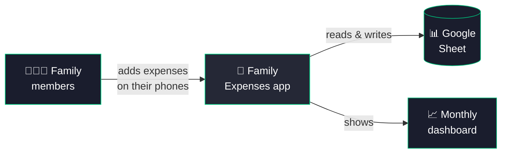
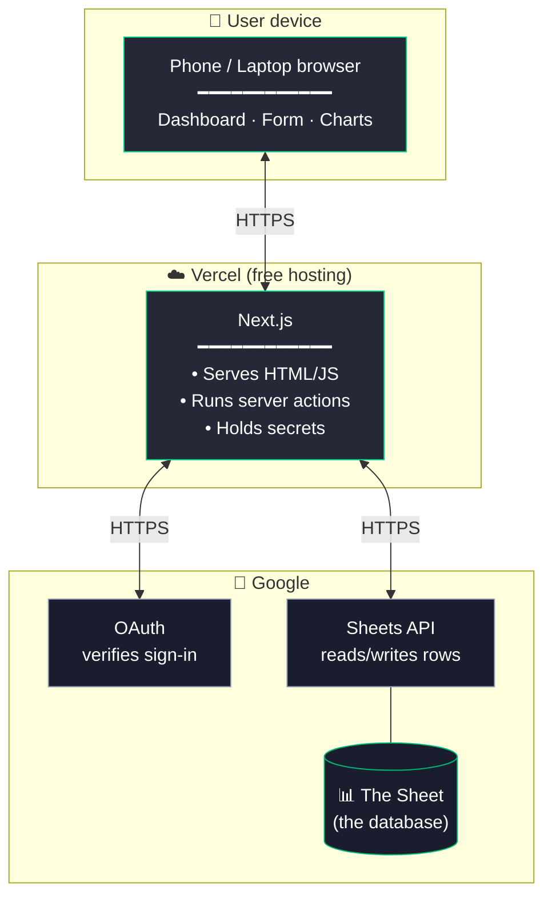
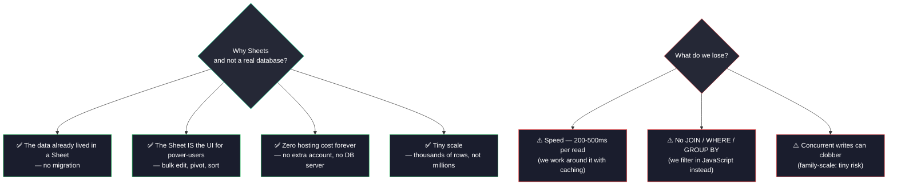
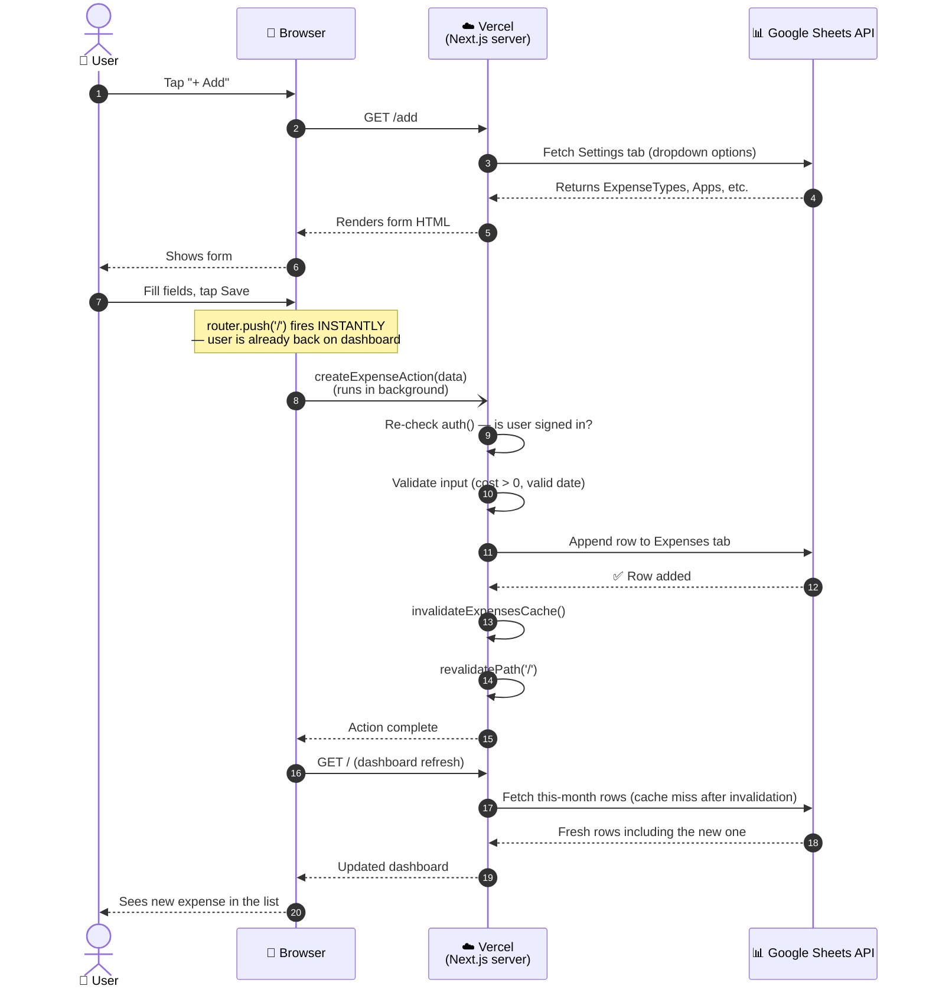
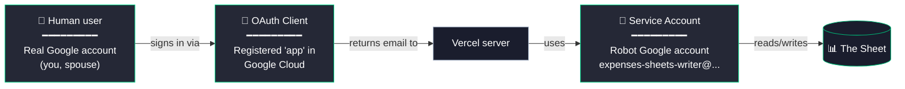
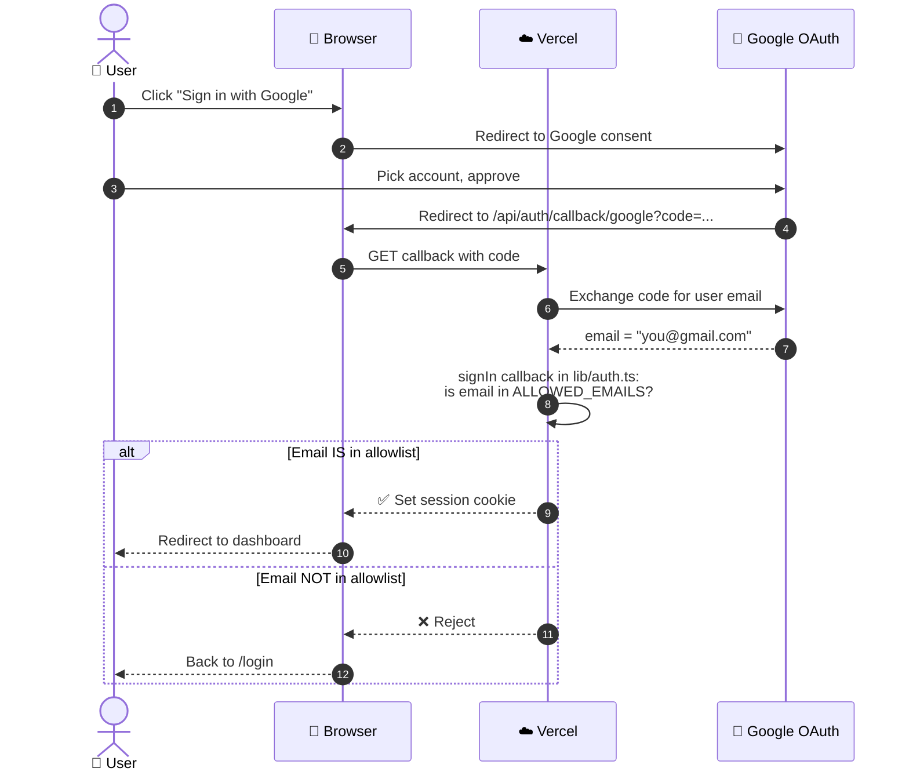
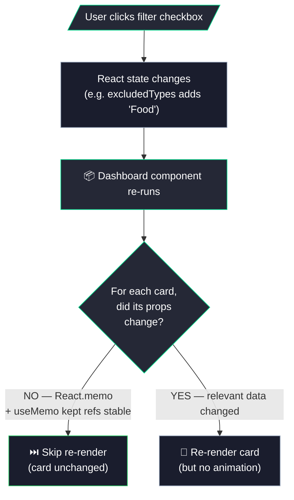
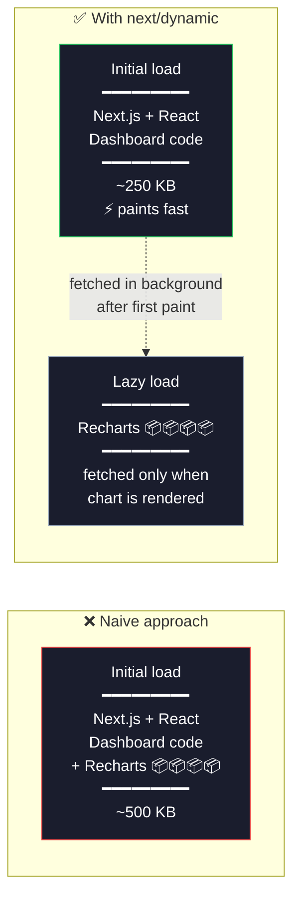
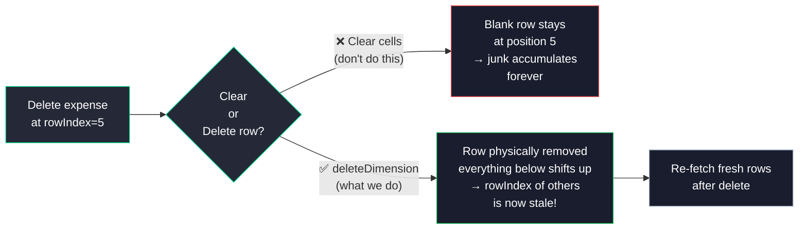
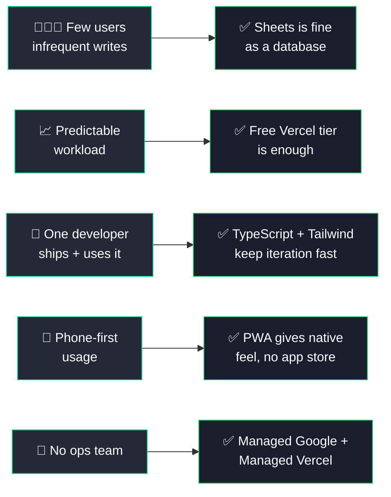

# How Family Expenses Works

**Audience:** Someone comfortable with basic programming concepts (variables, functions, HTTP requests) but new to web app architecture.

This document explains *what* the app is made of, *how* the pieces fit together, and — most importantly — *why* each piece was chosen over the alternatives.

> **Heads up on the diagrams:** This doc uses [Mermaid](https://mermaid.js.org/) for diagrams. GitHub renders them automatically — if you're reading this on GitHub.com you'll see them as actual pictures. If you're reading the raw `.md` file, you'll see the source code instead; open it on GitHub for the visual version.

---

## 1. What the app does



A private expense tracker that a small group (a family) signs into with their Google accounts. They add expenses through a phone-friendly web app, see a dashboard of monthly spending, and the data lives in a Google Sheet they already own.

**No separate database. No app store. No monthly hosting fee.**

---

## 2. The whole stack at a glance

Three boxes. The browser talks only to Vercel. Vercel is the only thing allowed to talk to Google. The Google Sheet is the database.



---

## 3. Why each piece was chosen

### 3.1 Why Next.js

Next.js is a framework that gives you **both** the frontend (what the user sees) and a small backend (server-side functions) in the same project. For a small app, that combo is a huge win.

| What you get | Why it matters here |
|---|---|
| **Server Components + Server Actions** | Write a function that *looks* normal but actually runs on the server. The browser calls it like a local function. |
| **No separate backend** | One project, one deploy. Compare to "React + Express" = two of everything. |
| **File-based routing** | A file at `app/expenses/page.tsx` automatically becomes the URL `/expenses`. |
| **TypeScript built in** | Catches typos and shape mismatches before the app runs. |

**Alternatives we passed on:**
- *Plain React + Express:* twice the code, two deploy targets.
- *Django/Rails:* great, but the dashboard is heavily interactive — that pulls us toward React anyway, at which point Next.js gives the backend for free.

### 3.2 Why Vercel


| Benefit | Detail |
|---|---|
| **Free tier covers us** | A family-sized app is nowhere near Vercel's free limits |
| **Push → live in 2 min** | No build server to configure |
| **Serverless functions** | Pay $0 when nobody is using the app — workers spin up only on demand |
| **HTTPS, env vars, custom domains** | All included |

**The trade-off:** serverless functions have *cold starts* (the first request after a quiet period is slower because Vercel has to wake a worker). For a family app, invisible.

### 3.3 Why Google Sheets as the database (the unusual choice)

This is the most interesting decision in the whole project. Normally you'd reach for Postgres, SQLite, MongoDB, or Firestore. We chose a Google Sheet. Why?



This decision is the **heart of the app's design** — almost every other choice flows from it.

### 3.4 Other choices, briefly

| Choice | Why |
|---|---|
| **TypeScript** | Plain JS would silently break on `expense.cot` (typo). TS flags it before save. |
| **Tailwind CSS** | Style with utility classes next to the markup — less file-hopping. Reusable patterns live in `globals.css`. |
| **Recharts** | React-friendly, SVG-based charts. Chunky (~250 KB) so we load it on-demand only on the dashboard. |
| **PWA (not native app)** | One codebase, no app-store reviews, instant updates. "Add to Home Screen" gives a native feel. |

---

## 4. End-to-end: "User adds a ₹500 grocery expense"

Here's what happens when someone taps Save. The sequence diagram shows every hop and what runs where.



**The key trick** is step 7: we navigate the user away *before* the save completes. The Sheet write is slow (200–500 ms) but the user never waits for it.

---

## 5. The single most important performance trick: caching

Google Sheets is slow. If we hit it on every page load and every filter click, the app would feel sluggish. So we cache — in **two layers**, which are commonly confused.

```mermaid
flowchart TB
    Req[/"Request to load<br/>dashboard"/] --> A{Layer A:<br/>In-memory<br/>data cache}
    A -->|Cache HIT<br/>(< 60s old)| Fast["⚡ Return cached rows<br/>~1 ms"]
    A -->|Cache MISS| Slow["🐢 Call Google Sheets<br/>~300 ms"]
    Slow --> Store["Store in cache<br/>with timestamp"]
    Store --> Fast2["Return rows"]

    Write[/"Someone saves<br/>an expense"/] --> Inv["invalidateExpensesCache()"]
    Inv -->|"clears Layer A"| A

    Write --> Rev["revalidatePath('/')"]
    Rev -->|"clears Layer B<br/>(Next.js render cache)"| B["Next.js will<br/>re-render the page"]

    style A fill:#252836,stroke:#00D689,color:#fff
    style B fill:#252836,stroke:#00D689,color:#fff
    style Fast fill:#1A1D2D,stroke:#22C55E,color:#fff
    style Fast2 fill:#1A1D2D,stroke:#22C55E,color:#fff
    style Slow fill:#1A1D2D,stroke:#EF4444,color:#fff
    style Inv fill:#1A1D2D,stroke:#94A3B8,color:#fff
    style Rev fill:#1A1D2D,stroke:#94A3B8,color:#fff
```

| Layer | What it caches | TTL | Cleared by |
|---|---|---|---|
| **A — Data cache** | The result of `getAllExpenses()` / `getSettings()` | 60 seconds | `invalidateExpensesCache()` / `invalidateSettingsCache()` |
| **B — Next.js render cache** | The rendered HTML for a URL | Until you say so | `revalidatePath('/')` |

> **The critical invariant:** every server action that writes data must call **both** invalidations. If you only call one, you get half-stale state for up to 60 seconds. Every mutation in [app/actions.ts](app/actions.ts) follows this pattern.

---

## 6. Authentication: who's allowed in?

Three different "identities" are involved, and people often confuse them.



| Identity | What it does |
|---|---|
| **Human user** | Signs in. Identity check only — never directly touches the Sheet. |
| **OAuth Client** | The intermediary that lets Google show "Sign in with Google" on our behalf. |
| **Service Account** | The robot that actually reads/writes the Sheet on the server side. |

### Sign-in flow



**That's the entire access control layer.** Adding a family member = 2 changes:
1. Add their email to `ALLOWED_EMAILS` in Vercel env vars
2. Add their initials to the `PaidBy` column in the Sheet

No code changes.

### Why the human doesn't touch the Sheet directly

The service account's private key never leaves Vercel — it's in an env var. The user never sees a "this app wants access to your Sheets" consent screen for *data* access, because they aren't the one doing it. Even if a user's session were compromised, no Sheet credentials are extractable from the browser.

---

## 7. How the dashboard stays fast under filter changes

Toggle a filter on the dashboard — totals, pie chart, and transaction list all update instantly. Behind the scenes that's a lot of re-rendering.



Three techniques work together:

| Technique | Where | What it does |
|---|---|---|
| **`React.memo`** | every card in [components/cards/](components/cards/) | Skips re-render if props are referentially the same |
| **`useMemo` / `useCallback`** | [components/Dashboard.tsx](components/Dashboard.tsx) | Keeps prop references stable across renders, so `React.memo` actually works |
| **`isAnimationActive={false}`** | every Recharts chart | Removes the per-toggle animation that's jittery and expensive |

**Bonus:** all the aggregation (totals, by-category sums, daily series) happens **in the browser** from rows we already have. Toggling a filter never makes a network request.

---

## 8. Code splitting: keeping the initial load small

A modern web app's biggest enemy on a phone is **bundle size** — the JavaScript the browser must download before anything works. Recharts alone is ~250 KB.



The fix is one line per chart:

```ts
const CategoryPie = dynamic(() => import('./CategoryPie'), { ssr: false })
```

Charts appear a fraction of a second after the cards, but the initial paint is **much** faster.

---

## 9. The Sheet's structure (the "schema")

Even though Sheets isn't a real database, the columns are a contract.

### `Expenses` tab — one row per expense

| Col | Field | Example | Notes |
|---|---|---|---|
| A | Month (auto) | `2026-05` | Server computes this on write — enables fast month filtering |
| B | Date | `2026-05-24` | |
| C | Expense Type | `Grocery` | Freeform; new values auto-added to Settings |
| D | App | `Amazon Now` | Freeform; auto-added |
| E | Mode of Payment | `UPI` | Freeform; auto-added |
| F | Name | `Weekly veggies` | Description |
| G | Cost | `547` | |
| H | Paid By | `A` | Curated list (typos here corrupt attribution) |
| I | 1 time | `Y` or blank | Rare expenses we can exclude from totals |
| J | Tags | `vacation, gift` | Curated list |

### `Settings` tab — five lookup lists

Five columns, each an independent list: `ExpenseTypes`, `Apps`, `PaymentModes`, `PaidBy`, `Tags`. Row 1 is the header.

### The subtle invariant about deletes

Each row in our `Expense` type carries a `rowIndex` (the 1-based Sheet row). When we delete:



We chose `deleteDimension` because the alternative — accumulating blank rows forever — is worse. The trade-off is we must re-fetch after a delete.

---

## 10. Why this stack is right for *this* app

The recurring theme in every choice is **"small scale, free, low maintenance":**



A larger app — say, 10,000 users with concurrent edits — would outgrow Sheets in a week. But for a family, this architecture has one beautiful property:

> **The marginal cost of running it forever is zero.**

That's the design goal.

---

## Appendix: where to look in the code

| If you want to understand... | Read... |
|---|---|
| The "endpoint" code (every save/delete) | [app/actions.ts](../app/actions.ts) |
| Talking to Google Sheets | [lib/sheets.ts](../lib/sheets.ts), [lib/expenses.ts](../lib/expenses.ts), [lib/settings.ts](../lib/settings.ts) |
| Sign-in / allowlist | [lib/auth.ts](../lib/auth.ts), [middleware.ts](../middleware.ts) |
| The dashboard (most React-heavy file) | [components/Dashboard.tsx](../components/Dashboard.tsx) |
| The form for adding/editing | [components/ExpenseForm.tsx](../components/ExpenseForm.tsx) |
| Design tokens / colors | [tailwind.config.ts](../tailwind.config.ts), [app/globals.css](../app/globals.css) |
| Setup instructions | [README.md](../README.md) |
| Project conventions | [CLAUDE.md](../CLAUDE.md) |
